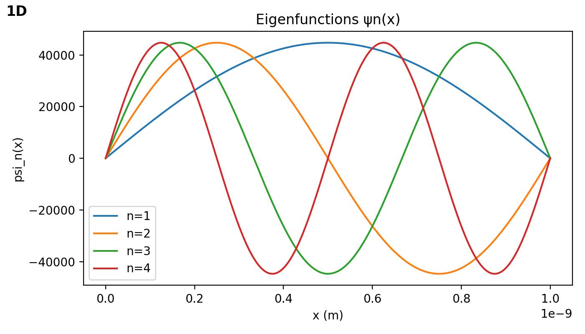
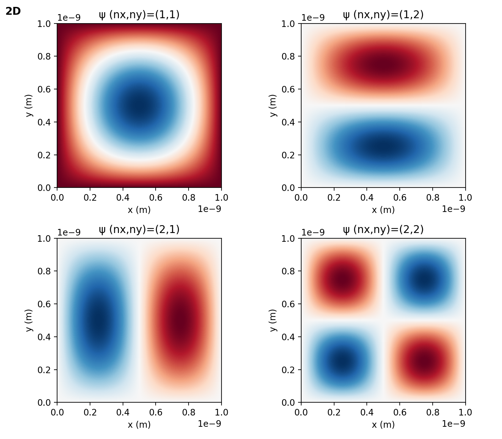
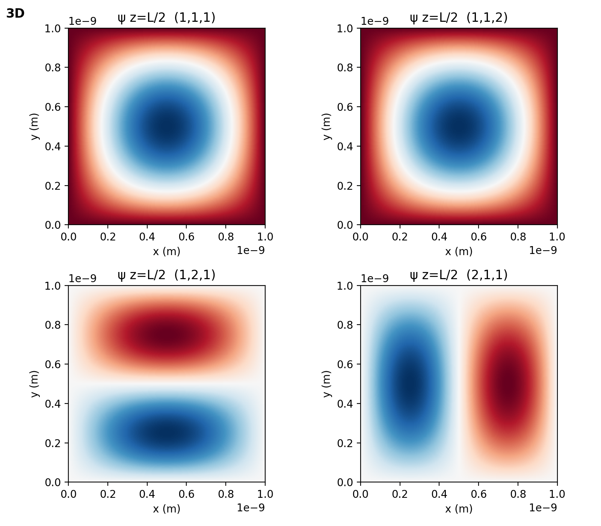
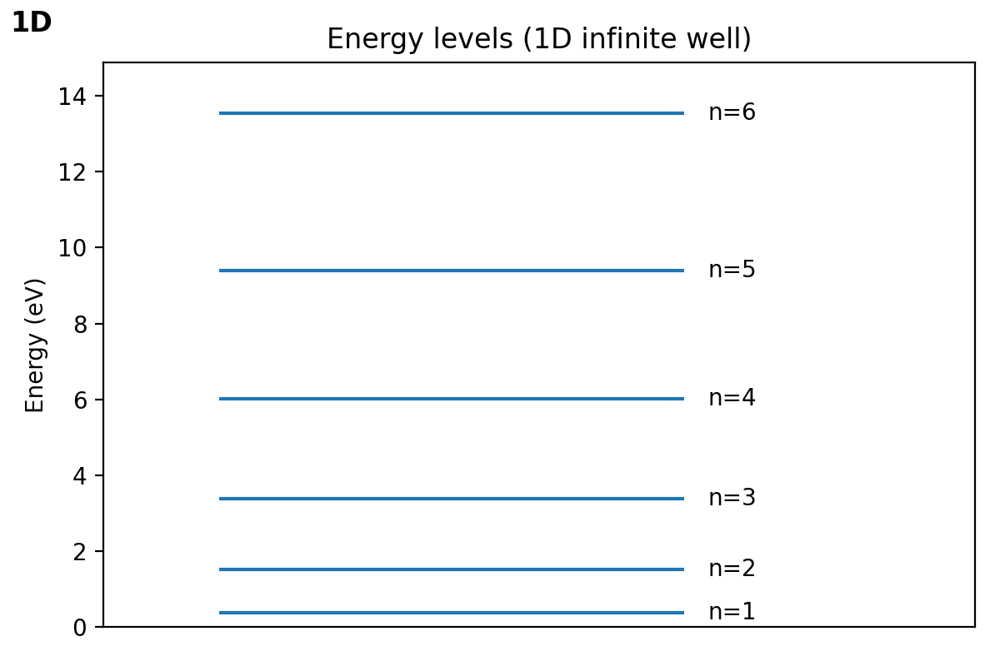
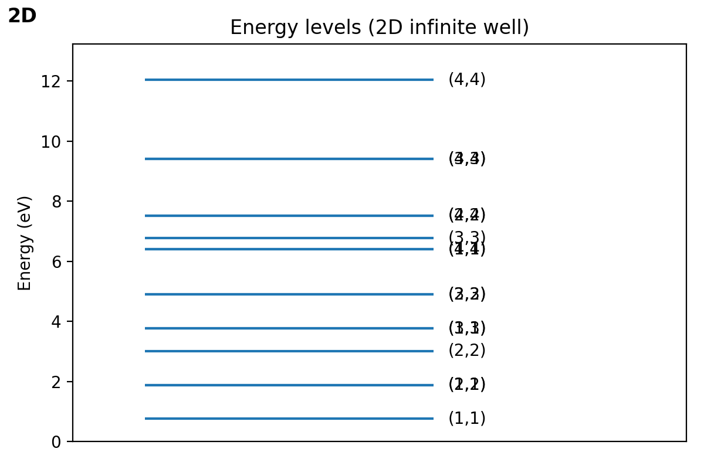
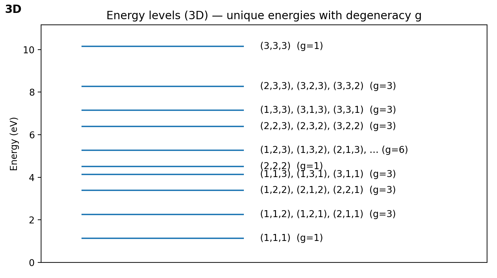

# Schrödinger's Wave Equation — Particle in a Box (1D/2D/3D)# Schrödinger's Wave Equation — Particle in a Box (1D/2D/3D)


> Quick links: [1D README](1D/README.md) · [2D README](2D/README.md) · [3D README](3D/README.md)> Quick links: [1D README](1D/README.md) · [2D README](2D/README.md) · [3D README](3D/README.md)


## Overview## Overview


This repository contains focused Python scripts to explore the time‑independent Schrödinger equation for infinite potential wells (aka the "particle in a box") in 1D, 2D, and 3D. Each script generates publication-quality figures for:This repository contains focused Python scripts to explore the time‑independent Schrödinger equation for infinite potential wells (aka the "particle in a box") in 1D, 2D, and 3D. Each script generates publication-quality figures for:


- Energy level diagrams- Energy level diagrams

- Eigenfunctions and probability densities- Eigenfunctions and probability densities

- Time evolution of superposition states- Time evolution of superposition states


The code is small, hackable, and ideal for learning, teaching, and making quick visualizations of quantum mechanics fundamentals.The code is small, hackable, and ideal for learning, teaching, and making quick visualizations of quantum mechanics fundamentals.


## Math background (quick reference)## Math background (quick reference)


For an infinite square well of length L (0 ≤ x ≤ L) in 1D, the stationary states areFor an infinite square well of length L (0 ≤ x ≤ L) in 1D, the stationary states are


$$\psi_n(x) = \sqrt{\frac{2}{L}}\, \sin\left(\frac{n\pi x}{L}\right), \quad n = 1,2,3,\dots$$$$\psi_n(x) = \sqrt{\frac{2}{L}}\, \sin\left(\frac{n\pi x}{L}\right), \quad n = 1,2,3,\dots$$


with energieswith energies


$$E_n = \frac{n^2\pi^2\hbar^2}{2 m L^2}.$$$$E_n = \frac{n^2\pi^2\hbar^2}{2 m L^2}.$$


In 2D on a square domain 0 ≤ x ≤ L, 0 ≤ y ≤ L, the eigenstates and energies separate asIn 2D on a square domain 0 ≤ x ≤ L, 0 ≤ y ≤ L, the eigenstates and energies separate as


$$$$

\psi_{n_x,n_y}(x,y) = \frac{2}{L} \sin\left(\frac{n_x\pi x}{L}\right) \sin\left(\frac{n_y\pi y}{L}\right), \quad\psi_{n_x,n_y}(x,y) = \frac{2}{L} \sin\left(\frac{n_x\pi x}{L}\right) \sin\left(\frac{n_y\pi y}{L}\right), \quad

E_{n_x,n_y} = \frac{\pi^2\hbar^2}{2 m L^2} (n_x^2 + n_y^2).E_{n_x,n_y} = \frac{\pi^2\hbar^2}{2 m L^2} (n_x^2 + n_y^2).

$$$$


In 3D on a cube 0 ≤ x,y,z ≤ L, the solutions areIn 3D on a cube 0 ≤ x,y,z ≤ L, the solutions are


$$$$

\psi_{n_x,n_y,n_z}(x,y,z) = \left(\frac{2}{L}\right)^{3/2} \sin\left(\frac{n_x\pi x}{L}\right) \sin\left(\frac{n_y\pi y}{L}\right) \sin\left(\frac{n_z\pi z}{L}\right),\quad\psi_{n_x,n_y,n_z}(x,y,z) = \left(\frac{2}{L}\right)^{3/2} \sin\left(\frac{n_x\pi x}{L}\right) \sin\left(\frac{n_y\pi y}{L}\right) \sin\left(\frac{n_z\pi z}{L}\right),\quad

E_{n_x,n_y,n_z} = \frac{\pi^2\hbar^2}{2 m L^2} (n_x^2 + n_y^2 + n_z^2).E_{n_x,n_y,n_z} = \frac{\pi^2\hbar^2}{2 m L^2} (n_x^2 + n_y^2 + n_z^2).

$$$$


All three cases exhibit degeneracies when different quantum number sets yield the same energy sum.All three cases exhibit degeneracies when different quantum number sets yield the same energy sum.


## Project structure## Project structure


``````

README.md                   # You are hereREADME.md                   # You are here

LICENSE                     # MIT LicenseLICENSE                     # MIT License

requirements.txt            # Python dependencies (numpy, scipy, matplotlib)requirements.txt            # Python dependencies (numpy, scipy, matplotlib)

1D/1D/

  main.py                   # 1D infinite well script  main.py                   # 1D infinite well script

  README.md                 # 1D-specific documentation  README.md                 # 1D-specific documentation

  pics/                     # Generated figures (created at runtime)  pics/                     # Generated figures (created at runtime)

2D/2D/

  main.py                   # 2D square well script  main.py                   # 2D square well script

  README.md                 # 2D-specific documentation  README.md                 # 2D-specific documentation

  pics/                     # Generated figures (created at runtime)  pics/                     # Generated figures (created at runtime)

3D/3D/

  main.py                   # 3D cubic well script  main.py                   # 3D cubic well script

  README.md                 # 3D-specific documentation  README.md                 # 3D-specific documentation

  pics/                     # Generated figures (created at runtime)  pics/                     # Generated figures (created at runtime)

``````


## Requirements## Requirements


- Python 3.9+ (3.10 or newer recommended)- Python 3.9+ (3.10 or newer recommended)

- Packages: `numpy`, `scipy`, `matplotlib`- Packages: `numpy`, `scipy`, `matplotlib`


Install using the root `requirements.txt`:Install using the root `requirements.txt`:


```bash```bash

python -m venv .venvpython -m venv .venv

source .venv/Scripts/activate  # Windows Git Bashsource .venv/Scripts/activate  # Windows Git Bash

pip install -r requirements.txtpip install -r requirements.txt

``````


Windows notes:Windows notes:


- Command Prompt (cmd.exe):- Command Prompt (cmd.exe):

  - `.venv\Scripts\activate`  - `.venv\Scripts\activate`

- PowerShell:- PowerShell:

  - `./.venv/Scripts/Activate.ps1`  - `./.venv/Scripts/Activate.ps1`


## How to run## How to run


### 1) 1D figures (energy levels, eigenfunctions, densities)### 1) Interactive electron cloud (Tkinter)


```bash- From the repository root:

python 1D/main.py

``````bash

python main.py

This will print a short summary and write several images into `1D/pics/`, including:```


- `energy_levels.png` — horizontal lines labeled by nWhat you’ll see:

- `energy_vs_n.png` — E vs n

- `eigenfunctions.png` — ψₙ(x) overlayed for n = 1..4- A black canvas where white dots are drawn according to |Ψ|² for the selected quantum number n.

- `eigenfunction_n{1..4}.png` — individual eigenfunction plots- An input for n; press Enter or click Update to redraw. For large n, you’ll see more nodes (zeros) where the cloud thins out.

- `psi_levels.png` — level diagram with eigenfunction slices

- `density_levels.png` — level diagram with |ψ|² slicesConfig knobs in `main.py` you can tweak:

- `probability_density_snapshots.png` — time snapshots for a 2-state superposition specified by `COEFFS` and `N_VALS`

- `L`: Well width in meters (default 1e-9).

Parameters (edit at the top of `1D/main.py`):- `N`: Spatial discretization for plotting/math (doesn’t affect sampling quality much).

- `NUM_DOTS`: Number of rejection-sampled points. Larger = smoother but slower.

- `L` (float, meters): well width (default 1e-9)- `CANVAS_WIDTH`, `CANVAS_HEIGHT`: Visualization size.

- `MASS_MODE` ("electron"|other): if "electron", uses electron mass; otherwise `MVAL`

- `MVAL` (float, kg): custom mass (used when `MASS_MODE` != "electron")### 2) 1D figures (energy levels, eigenfunctions, densities)

- `NMAX` (int): number of levels to plot

- `COEFFS` (list[complex]): coefficients for time‑evolving superposition```bash

- `N_VALS` (list[int]): corresponding quantum numbers for `COEFFS`python "particle in a box/1D/main.py"

```

### 2) 2D figures (modes on a square well)

This will print a short summary and write several images into `particle in a box/1D/pics/`, including:

```bash

python 2D/main.py- `energy_levels.png` — horizontal lines labeled by n

```- `energy_vs_n.png` — E vs n

- `eigenfunctions.png` — ψₙ(x) overlayed for n = 1..4

This writes analogous images into `2D/pics/`, e.g. 2D eigenfunctions as imshow heatmaps, energy stacks, and time-snapshot densities for a 2-mode superposition.- `eigenfunction_n{1..4}.png` — individual eigenfunction plots

- `psi_levels.png` — level diagram with eigenfunction slices

Parameters (edit at the top of `2D/main.py`):- `density_levels.png` — level diagram with |ψ|² slices

- `probability_density_snapshots.png` — time snapshots for a 2-state superposition specified by `COEFFS` and `N_VALS`

- `L` (float, meters): well width (default 1e-9)

- `MASS_MODE` ("electron"|other): if "electron", uses electron mass; otherwise `MVAL`Parameters at the top of the script control well size (`L`), mass (`MASS_MODE`/`MVAL`), how many levels to show (`NMAX`), and the superposition (`COEFFS`, `N_VALS`).

- `MVAL` (float, kg): custom mass (used when `MASS_MODE` != "electron")

- `NMAX` (int): max mode index along each axis when enumerating (nx, ny)Parameters (1D script quick reference):

- `COEFFS` (list[complex]): coefficients for time‑evolving superposition

- `N_VALS` (list[tuple[int,int]]): corresponding (nx, ny) pairs for `COEFFS`- `L` (float, meters): well width (default 1e-9)

- `MASS_MODE` ("electron"|other): if "electron", uses electron mass; otherwise `MVAL`

### 3) 3D figures (modes in a cubic well)- `MVAL` (float, kg): custom mass (used when `MASS_MODE` != "electron")

- `NMAX` (int): number of levels to plot

```bash- `COEFFS` (list[complex]): coefficients for time-evolving superposition

python 3D/main.py- `N_VALS` (list[int]): corresponding quantum numbers for `COEFFS`

```

### 3) 2D figures (modes on a square well)

This generates 3D energy level plots (including degeneracies), 2D slices of eigenfunctions at z=L/2, and time-snapshot densities, saved under `3D/pics/`.

```bash

Parameters (edit at the top of `3D/main.py`):python "particle in a box/2D/main.py"

```

- `L` (float, meters): well width (default 1e-9)

- `MASS_MODE` ("electron"|other): if "electron", uses electron mass; otherwise `MVAL`This writes analogous images into `particle in a box/2D/pics/`, e.g. 2D eigenfunctions as imshow heatmaps, energy stacks, and time-snapshot densities for a 2-mode superposition.

- `MVAL` (float, kg): custom mass (used when `MASS_MODE` != "electron")

- `NMAX` (int): max mode index along each axis when enumerating (nx, ny, nz)Parameters (2D script quick reference):

- `COEFFS` (list[complex]): coefficients for time‑evolving superposition

- `N_VALS` (list[tuple[int,int,int]]): corresponding (nx, ny, nz) triplets for `COEFFS`- `L` (float, meters): well width (default 1e-9)

- `MASS_MODE` ("electron"|other): if "electron", uses electron mass; otherwise `MVAL`

## Example outputs- `MVAL` (float, kg): custom mass (used when `MASS_MODE` != "electron")

- `NMAX` (int): max mode index along each axis when enumerating (nx, ny)

Running the 1D/2D/3D scripts will save PNG files into their respective `pics/` folders. Typical files include:- `COEFFS` (list[complex]): coefficients for time-evolving superposition

- `N_VALS` (list[tuple[int,int]]): corresponding (nx, ny) pairs for `COEFFS`

- `energy_levels.png`, `energy_vs_n.png`

- `eigenfunctions.png`, `eigenfunction_n{1..4}.png`Parameters (interactive app quick reference, `main.py`):

- `psi_levels.png`, `density_levels.png`

- `probability_density_snapshots.png`- `L` (float, meters): well width (default 1e-9)

- `N` (int): spatial sample points for convenience

## Screenshots- `NUM_DOTS` (int): number of rejection-sampled points (performance/quality)

- `CANVAS_WIDTH`, `CANVAS_HEIGHT` (int): pixel size of the Tk canvas

Below are a few representative visuals (paths are relative; run the 1D/2D/3D scripts to generate them):

### 4) 3D figures (modes in a cubic well)



```bash

python "particle in a box/3D/main.py"

```



This generates 3D energy level plots (including degeneracies), 2D slices of eigenfunctions at z=L/2, and time-snapshot densities, saved under `particle in a box/3D/pics/`.



Parameters (3D script quick reference):



- `L` (float, meters): well width (default 1e-9)

- `MASS_MODE` ("electron"|other): if "electron", uses electron mass; otherwise `MVAL`

- `MVAL` (float, kg): custom mass (used when `MASS_MODE` != "electron")

## Troubleshooting- `NMAX` (int): max mode index along each axis when enumerating (nx, ny, nz)

- `COEFFS` (list[complex]): coefficients for time-evolving superposition

- SciPy installation on Windows: use a recent Python (3.10+) and pip; if you hit build errors, upgrade pip and wheel (`pip install -U pip wheel`) or use a Python distribution that ships SciPy wheels.- `N_VALS` (list[tuple[int,int,int]]): corresponding (nx, ny, nz) triplets for `COEFFS`

- No images appear in `pics/`: ensure the script has permission to create directories/files in those folders.

- Matplotlib backend issues: if plots don't save, set `MPLBACKEND=Agg` before running.## Example outputs


## Notes and limitationsRunning the 1D and 2D scripts will save PNG files into their respective `pics/` folders. Typical files include:


- The well is "infinite" (hard walls). Finite wells require different boundary conditions and are not modeled here.- `energy_levels.png`, `energy_vs_n.png`

- Time evolution in the scripts is limited to simple, user‑defined superpositions to illustrate interference and beat periods.- `eigenfunctions.png`, `eigenfunction_n{1..4}.png`

- Degeneracies in 2D/3D arise when different quantum number tuples yield the same sum of squares.- `psi_levels.png`, `density_levels.png`

- `probability_density_snapshots.png`

## Contributing

## Screenshots

Issues and PRs are welcome. Ideas that would be great additions:

Below are a few representative visuals (paths are relative; run the 1D/2D/3D scripts to generate them):

- Add an option to animate time evolution (matplotlib FuncAnimation).

- Add a finite well or harmonic oscillator example for comparison.

- Export figures at publication resolution with consistent style.


## Acknowledgments


- Physical constants from `scipy.constants`.

- Visualization built with Matplotlib; numerics with NumPy and SciPy.


## License


This project is licensed under the MIT License. See the [`LICENSE`](./LICENSE) file for details.


## Troubleshooting

- SciPy installation on Windows: use a recent Python (3.10+) and pip; if you hit build errors, upgrade pip and wheel (`pip install -U pip wheel`) or use a Python distribution that ships SciPy wheels.
- Tkinter missing (mostly Linux): install your distro’s Tk package, e.g. `sudo apt-get install python3-tk`.
- Canvas feels slow: reduce `NUM_DOTS` in `main.py` (e.g., from 100000 → 20000) or shrink the canvas size.
- No images appear in `pics/`: ensure the script has permission to create directories/files in those folders.

## Notes and limitations

- The well is “infinite” (hard walls). Finite wells require different boundary conditions and are not modeled here.
- The interactive app uses rejection sampling to produce visually intuitive dot clouds; it’s stochastic and not a line plot of |Ψ|².
- Time evolution in the 1D/2D scripts is limited to simple, user‑defined superpositions to illustrate interference and beat periods.

## Acknowledgments

- Physical constants from `scipy.constants`.
- Visualization built with Tkinter and Matplotlib; numerics with NumPy and SciPy.

## License

This project is licensed under the MIT License. See the [`LICENSE`](./LICENSE) file for details.
